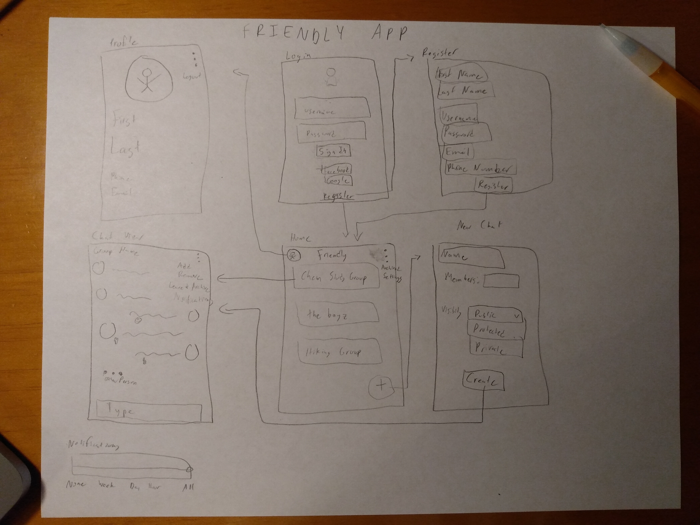

# friendly

## Table of Contents
1. [Overview](#Overview)
1. [Product Spec](#Product-Spec)
1. [Wireframes](#Wireframes)
2. [Schema](#Schema)

## Overview
### Description
A simple, clean, lite, and fun group chat app. Easy to join and manage.

### App Evaluation
[Evaluation of your app across the following attributes]
- **Category:** Social
- **Mobile:** It's a real time app that can access your camera
- **Story:** The value is that this app would be very easy to chat with peers.
- **Market:** The user base is potentially huge. Mostly it would be used for kids in high school through college. 
- **Habit:** The habit would be from friends sending stuff.
- **Scope:** It would be quite feasible to build it.

## Product Spec

### 1. User Stories (Required and Optional)

**Required Must-have Stories**

* User can log in with account or with Facebook/Google
* User can send view groups of which he is a member
* User can create new groups
* User can add people to groups
* User can leave groups
* User can send a message in the app to the group
* User can set their profile picture with the camera

**Optional Nice-to-have Stories**

* User can send media messages (images, videos)
* User can react to others' messages
* User can see typing indicators/read receipts
* User can be admin and remove others from groups
* User can direct message
* User scan QR code to join chat

### 2. Screen Archetypes

* Login Screen
    * User can login
* Registration Screen
    * User can register
* Profile Screen
    * User can change their profile picture
* Home Screen
    * User can see all chats of which they are a member of
    * User can leave chats by selecting them
* Group Screen
    * User can send a message
    * User can add members
    * User can leave chat

### 3. Navigation

**Tab Navigation** (Tab to Screen)

* Home Screen
* Profile Screen

**Flow Navigation** (Screen to Screen)

* Login
    * Home
* Login
    * Registration
* Registration
    * Home
* Home
    * Group
* Group
    * Profile

## Wireframes

## Schema 
### Models

#### User
   | Property     | Type      |
   | ------------ | --------- |
   | objectId     | String    |
   | createdAt    | DateTime  |
   | updatedAt    | DateTime  |
   | username     | String    |
   | password     | String    |
   | email        | String    |
   | phoneNumber  | String    |
   | firstName    | String    |
   | lastName     | String    |
   | profilePic   | File      |
   
#### Group
   | Property  | Type      |
   | --------- | --------- |
   | objectId  | String    |
   | createdAt | DateTime  |
   | groupName | String    |
   
#### Group__User
   | Property  | Type
   | --------- | ------------------ |
   | user      | Pointer to User    |
   | group     | Pointer to Group   |
   | current   | Boolean            |
   
#### Message
   | Property  | Type            |
   | --------- | --------------- |
   | objectId  | String          |
   | createdAt | DateTime        |
   | author    | Pointer to User |
   | body      | String          |

### Networking
- [Add list of network requests by screen ]
- [Create basic snippets for each Parse network request]
- [OPTIONAL: List endpoints if using existing API such as Yelp]
